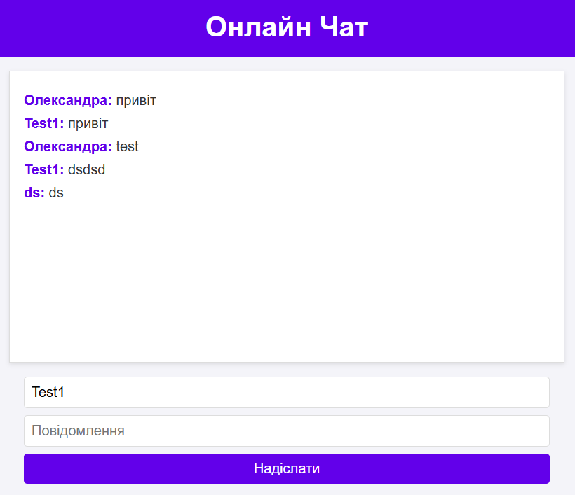

# Online Chat 💬

## Project Overview 🌐

This project is a **web-based real-time chat application** built using **Laravel** and **WebSockets**. It allows users to exchange messages instantly, providing a seamless communication experience. The chat leverages the **BeyondCode Websockets** package to establish WebSocket connections, and **Axios** is used on the frontend for communication with the server.

## Features ✨

- **Real-Time Communication**: Users can exchange messages instantly without refreshing the page.
- **WebSocket Integration**: Utilizes WebSockets for continuous connection to the server.
- **Multiple Users**: Supports chatting between multiple users in a single session.
- **Simple Interface**: Easy-to-use interface for a smooth chat experience.

## Technologies Used ⚙️

- **Laravel**: Backend framework used to build the application.
- **WebSockets**: For real-time message exchange.
- **Axios**: To handle HTTP requests on the frontend.
- **MySQL**: Database used to store user data and messages.
- **JavaScript**: For frontend interaction and WebSocket communication.

## How It Works 🛠️

1. **Real-Time Messaging**: Users send messages, and they appear instantly for everyone connected to the chat.
2. **WebSocket Connection**: The server maintains an open WebSocket connection with each user, allowing for continuous interaction.
3. **Frontend**: A clean, simple chat interface that updates dynamically as new messages are received.

## Screenshot 📸

_Screenshot of the chat interface_

## License 📝

This project is licensed under the **MIT License**.

## Help 🤔

If you have any questions or need assistance, feel free to open an issue on GitHub or email the project maintainers at: `c.liamtseva.oleksandra@student.uzhnu.edu.ua `.

## Installation 🚀

- Clone the repository to your local machine.
- Open the app in your browser at `https://online-chat.test`.
